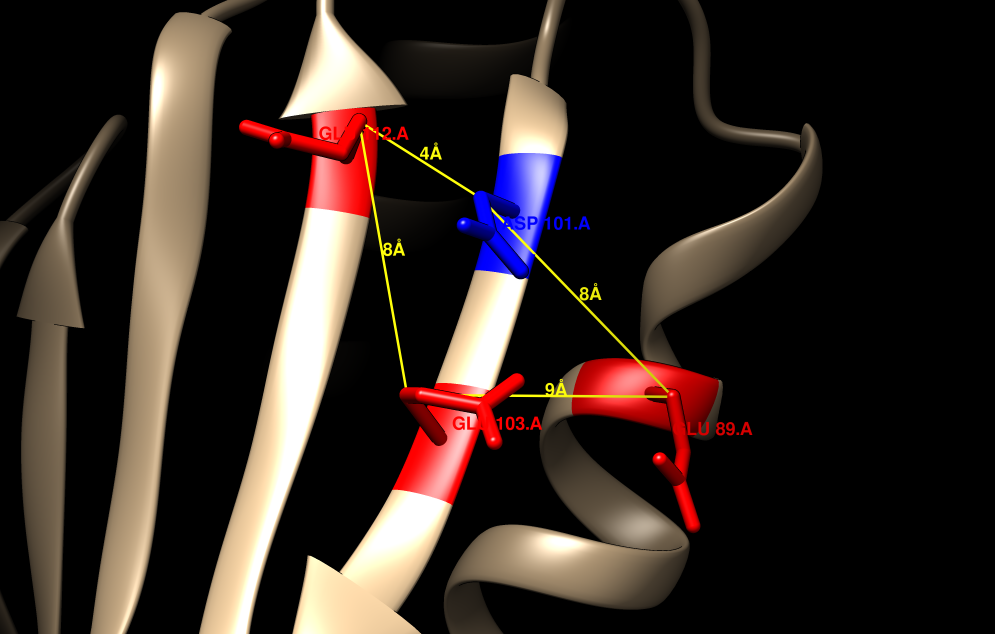

# Residue-search

## Residue Search Procedure
### Matteo Peluso, Doctoral Researcher Methods and Models for Molecular Sciences
#### email: matteo.peluso@sns.it

Description:

       Procedure to evaluate the search of the quadrilateral structure defined 
       by the 4 residues of the 2fql.db --->  (89, 101, 103, 112)

